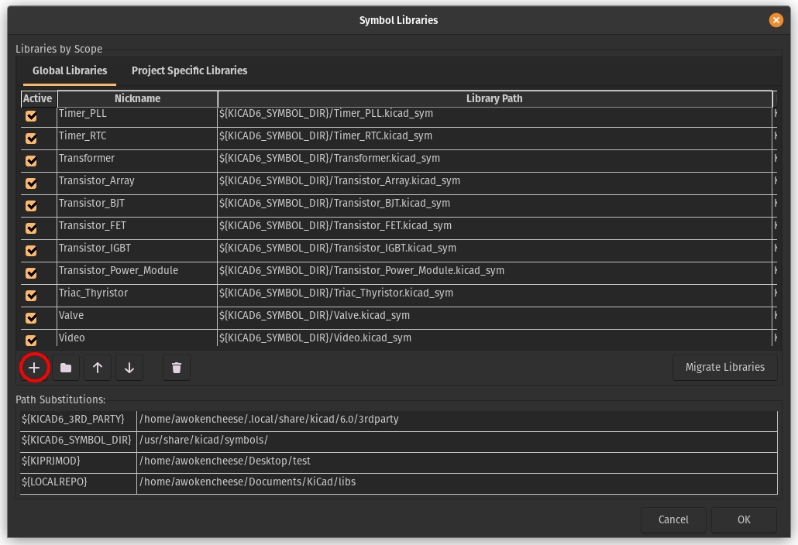

# CH552G-Kicad-Footprint
Kicad symbol and footprint for [WCH 552G Microcontroller](https://raw.githubusercontent.com/WeActStudio/WeActStudio.CH552CoreBoard/master/Datasheet/CH552DS1_en.PDF).

## Install
- Download the footprint and symbol files.
- Put the files somewhere they can live long-term.

### Symbols
- Open KiCad
- Click `Preferences` -> `Manage Symbol Libraries`
- Select `Global Libraries` and then `+`.

- Enter `CH552G` as Nickname.
- Enter the path to the downloaded `CH552G.kicad_sym` library as Library Path.

### Footprint
- Click `Preferences` -> `Manage Footprint Libraries`
- Select `Global Libraries` and then `+`.
- Enter `CH552G` as Nickname.
- Enter the path to the downloaded `CH552G.pretty` library as Library Path.
